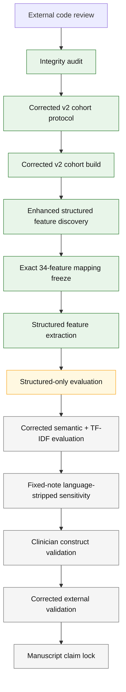

# 03 — Corrected v2 analysis lineage

Updated: 2026-09-24

This file is the ordered provenance map for the current manuscript-facing analysis.

Detailed protocol/result files are authoritative. This report tells you **what to read, in what order, and why**.

## Visual lineage

## Step 1 — Integrity audit: completed

Read:

1. `docs/external_review_integrity_audit_protocol_v1.md`
2. `docs/external_review_integrity_audit_result_freeze_v1.md`
3. `docs/integrity_review_hold_2026-09-24.md`

Canonical audit job:

- `N7Q8V4R5`
- artifact SHA-256: `c7c91a33f9ab41ed1efa87dc9efc09ade8a9624efe50ce88db89e82b5932e0a8`

Purpose: establish which v1 analyses are not manuscript-ready and freeze the required corrections before rebuilding.

## Step 2 — Corrected v2 cohort: completed

Read:

1. `docs/corrected_landmark12_v2_protocol.md`
2. `docs/corrected_landmark12_v2_cohort_result_freeze.md`

Canonical cohort job:

- `Q8R3V7M4`
- artifact SHA-256: `e1113d0a280389c61ea5b6d326ca81bb3e128854aba3d085837baa2e8d180e12`

Key decisions:

- fixed 12-hour landmark;
- 12-hour horizon;
- ventilation/RRT MetaVision-only;
- ICU death source-independent;
- no `dbsource` predictor;
- note selected before any language sensitivity;
- no primary matched case-control sampling.

## Step 3 — Enhanced structured baseline discovery/mapping: completed

Read:

1. `docs/enhanced_structured_baseline_discovery_protocol_v2.md`
2. `docs/enhanced_structured_baseline_discovery_lineage_note.md`
3. `docs/enhanced_structured_baseline_mapping_freeze_v2.md`

The first two discovery audits contained availability-accounting bugs and are preserved only for provenance. The final corrected discovery audit was:

- job `X8R4Q7M3`
- artifact SHA-256: `acb466d70fe1ef6af9ef7a58ae784a2810d5206aee0cf218329beb40e5d99a7b`

The exact 34-feature mapping was frozen only after the corrected audit.

## Step 4 — Enhanced structured feature extraction: completed

Read:

- `docs/enhanced_structured_baseline_feature_result_freeze_v2.md`

Canonical extraction job:

- `C8R6Q9M5`
- artifact SHA-256: `7c40ef2dfc28af23ac12e544226570787ea6d2ad6a20aadc8b177356c15e287f`

The failed predecessor `Z8R5Q7M4` is provenance only; it failed before extraction because MIMIC deidentified elderly DOB shifts overflowed pandas timedelta arithmetic. The corrected run uses safe Python date arithmetic.

## Step 5 — Structured-only predictive evaluation: active

Read:

- `docs/enhanced_structured_baseline_evaluation_protocol_v2.md`

Current canonical job:

- `E8R7Q5M3 — Evaluate Enhanced Structured V2`
- exact commit: `0f72c995d240900e15d65dd7b6e3c4f7048453ea`
- status at last documentation update: **running**

This is the first corrected v2 predictive-performance gate.

It will establish:

- linear structured performance;
- nonlinear structured performance;
- calibration and decision curves;
- repeated split/training variability;
- paired bootstrap uncertainty.

Semantic and lexical v2 analyses remain locked until this result is frozen.

## Step 6 — Corrected semantic + lexical evaluation: not yet run

Planned requirements:

- reuse the exact patient-grouped v2 split assignments from Step 5;
- rerun semantic inference on the corrected v2 note corpus;
- use stored max/min chunk aggregation consistently;
- compare against both linear and nonlinear structured baselines;
- include note context without `dbsource`;
- include TF-IDF lexical control.

No v1 semantic performance should be inserted into this step.

## Step 7 — Fixed-note treatment-language sensitivity: not yet run

The note identity, timestamp, category, and availability remain fixed.

Only prespecified direct treatment/outcome-language spans are removed from the selected note text.

This sensitivity is mandatory, especially for RRT.

## Step 8 — Clinician construct validation: not yet run

Required before manuscript lock:

- blinded note sample;
- multiple clinical raters;
- explicit definitions of the eight constructs;
- inter-rater reliability;
- model-vs-human agreement;
- construct calibration/validity.

## Step 9 — Corrected external validation: not yet complete

Read:

- `docs/05_EXTERNAL_VALIDATION_STATUS.md`

Affected v1 eICU and Zigong analyses require corrected v2 reruns.

## Step 10 — Manuscript claim lock: future

The central claim should be frozen only after Steps 5–9 are interpretable.

No additional model shopping should occur merely because a corrected v2 result is disappointing.
