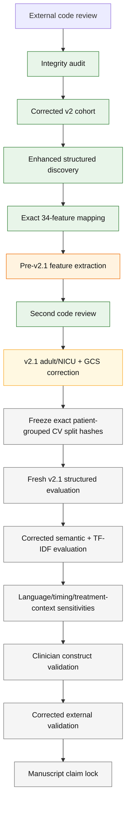

# 03 — Corrected v2/v2.1 analysis lineage

Updated: 2026-09-24

This is the ordered provenance map for the current manuscript-facing analysis.

Detailed frozen protocol/result files remain authoritative for exact definitions, settings, counts, seeds, hashes, and interpretation rules. This report tells you what to read, in what order, and which branches are superseded.

## Visual lineage

## Step 1 — Integrity audit: completed

Read:

1. `docs/external_review_integrity_audit_protocol_v1.md`
2. `docs/external_review_integrity_audit_result_freeze_v1.md`
3. `docs/integrity_review_hold_2026-09-24.md`

Canonical audit job:

- `N7Q8V4R5`
- artifact SHA-256: `c7c91a33f9ab41ed1efa87dc9efc09ade8a9624efe50ce88db89e82b5932e0a8`

This established why the v1 manuscript-facing estimates are provenance only.

## Step 2 — Corrected v2 cohort: completed, then superseded by v2.1 eligibility correction

Read:

1. `docs/corrected_landmark12_v2_protocol.md`
2. `docs/corrected_landmark12_v2_cohort_result_freeze.md`

Canonical v2 cohort job:

- `Q8R3V7M4`
- artifact SHA-256: `e1113d0a280389c61ea5b6d326ca81bb3e128854aba3d085837baa2e8d180e12`

v2 successfully corrected:

- ventilation/RRT source compatibility;
- note-category normalization;
- numeric error-flag handling;
- note selection before language sensitivity;
- removal of `dbsource` as a predictor;
- the matched-cohort control-pool problem.

The second review then found that the all-source ICU-death branch had no adult/NICU restriction. Therefore the v2 cohort counts remain provenance until rebuilt as v2.1.

## Step 3 — Enhanced structured discovery/mapping: completed

Read:

1. `docs/enhanced_structured_baseline_discovery_protocol_v2.md`
2. `docs/enhanced_structured_baseline_discovery_lineage_note.md`
3. `docs/enhanced_structured_baseline_mapping_freeze_v2.md`

Final corrected discovery audit:

- `X8R4Q7M3`
- artifact SHA-256: `acb466d70fe1ef6af9ef7a58ae784a2810d5206aee0cf218329beb40e5d99a7b`

The core 34-feature mapping remains the base mapping.

## Step 4 — Pre-v2.1 structured feature extraction: technically completed, not manuscript-final

Read:

- `docs/enhanced_structured_baseline_feature_result_freeze_v2.md`

Canonical extraction:

- `C8R6Q9M5`
- artifact SHA-256: `7c40ef2dfc28af23ac12e544226570787ea6d2ad6a20aadc8b177356c15e287f`

This extraction is not the final feature result because:

- the cohort may contain pediatric/NICU stays;
- GCS verbal can encode ETT/tracheostomy as numeric 1.

Its availability figures are retained as provenance.

## Step 5 — Second review / v2.1 correction gate: active

Read:

1. `docs/06_POSTREVIEW_V2_1_CORRECTIONS.md`
2. `docs/enhanced_structured_baseline_mapping_addendum_v2_1.md`
3. `docs/enhanced_structured_baseline_evaluation_addendum_v2_1.md`

Confirmed code-review corrections include:

- adult age >=18 at ICU admission;
- explicit NICU first-careunit exclusion;
- ETT/tracheostomy-coded verbal GCS treated as missing;
- case-only `event_time`;
- corrected treatment-language regexes;
- ventilation endpoint sensitivity arms;
- meaningful all-clinical-missing diagnostics;
- exact split-file hashes;
- calibration-in-the-large separated from joint recalibration intercept.

Draft v2.1 code is in:

- `src/104_build_corrected_landmark12_v2_1_cohorts.py`
- `src/105_build_enhanced_structured_baseline_v2_1.py`
- `src/106_freeze_enhanced_structured_cv_splits_v2_1.py`
- `src/107_evaluate_enhanced_structured_baseline_v2_1.py`

No v2.1 execution has been requested yet.

## Pre-v2.1 structured evaluation job

The previously submitted job:

- `E8R7Q5M3 — Evaluate Enhanced Structured V2`
- exact commit: `0f72c995d240900e15d65dd7b6e3c4f7048453ea`
- canonical status: **failed**
- exit code: 124
- stop reason: 240-minute timeout
- terminal progress: 1,026 / 3,075 work units (33.37%)
- terminal phase: RRT repeat 1, fold 1
- declared artifacts: none

The execution log contains no scientific/model traceback; only scikit-learn deprecation warnings before RunRelay terminated the process at the task timeout. The run had completed the full ventilation stage, including 1,000 bootstrap iterations, but the aggregate output file is written only after all outcomes, so no performance artifact was published.

This belongs to the pre-v2.1 cohort/feature lineage and will **not** be retried.

It cannot resolve the adult/NICU or GCS-verbal issues because those are upstream of model fitting.

## Step 6 — Freeze exact v2.1 patient-grouped splits: future

The split-freeze step must:

- generate the five repeated five-fold patient-grouped assignments once;
- save row-level assignments locally;
- report only aggregate counts and SHA-256 hashes;
- refuse to overwrite a non-identical existing split file.

Downstream structured, semantic, and lexical models must load these exact hashes.

## Step 7 — Fresh v2.1 structured evaluation: future

The structured evaluator will use:

- the corrected adult v2.1 cohort;
- corrected 34-feature core physiology;
- regularized logistic regression;
- fixed histogram-gradient-boosting comparator;
- pre-frozen patient-grouped splits;
- 1,000 paired patient-cluster bootstrap replicates.

It will report separately:

- calibration-in-the-large;
- joint recalibration intercept;
- calibration slope.

The bootstrap remains conditional on fixed repeated cross-fitted predictions and does not include full refit variance.

## Step 8 — Corrected semantic + lexical evaluation: not yet run

Requirements:

- rerun semantic inference on the v2.1 selected-note corpus;
- use stored max/min chunk aggregation;
- use the exact frozen v2.1 split hashes;
- compare against both linear and nonlinear core structured models;
- include TF-IDF lexical control;
- keep note context free of `dbsource`.

No pre-v2.1 performance should be substituted.

## Step 9 — Mandatory sensitivity layer: not yet run

Read `docs/06_POSTREVIEW_V2_1_CORRECTIONS.md`.

Required sensitivity domains:

- ventilation endpoint breadth;
- fixed-note treatment-language stripping with corrected regexes;
- CHARTEVENTS storetime availability;
- 1-hour and 2-hour laboratory-result lag;
- note-storetime/fallback timing;
- secondary treatment/support structured comparator.

## Step 10 — Clinician construct validation: not yet run

Required before manuscript lock:

- blinded note sample;
- multiple clinical raters;
- explicit definitions for the eight semantic constructs;
- inter-rater reliability;
- model-versus-human agreement/calibration.

## Step 11 — Corrected external validation: not yet complete

Read:

- `docs/05_EXTERNAL_VALIDATION_STATUS.md`

Affected eICU and Zigong v1 analyses require corrected reruns. NWICU should be aligned to the corrected structured lineage.

## Step 12 — Manuscript claim lock: future

The central claim is frozen only after the corrected v2.1 primary and sensitivity analyses, construct validation, and external validation are interpretable.

No model shopping should be introduced merely because corrected results are less favorable.
